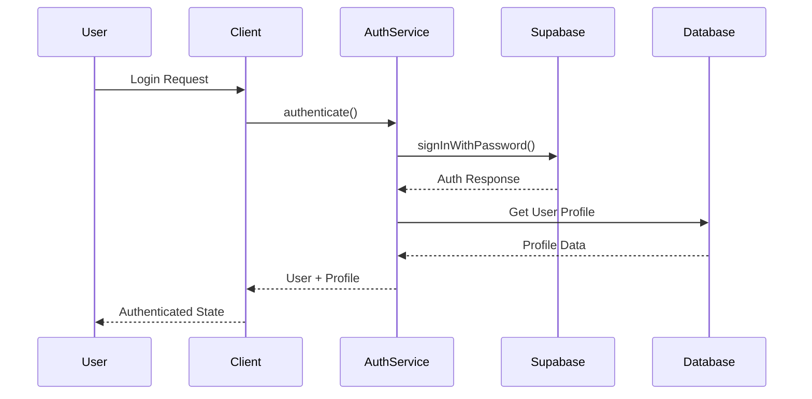
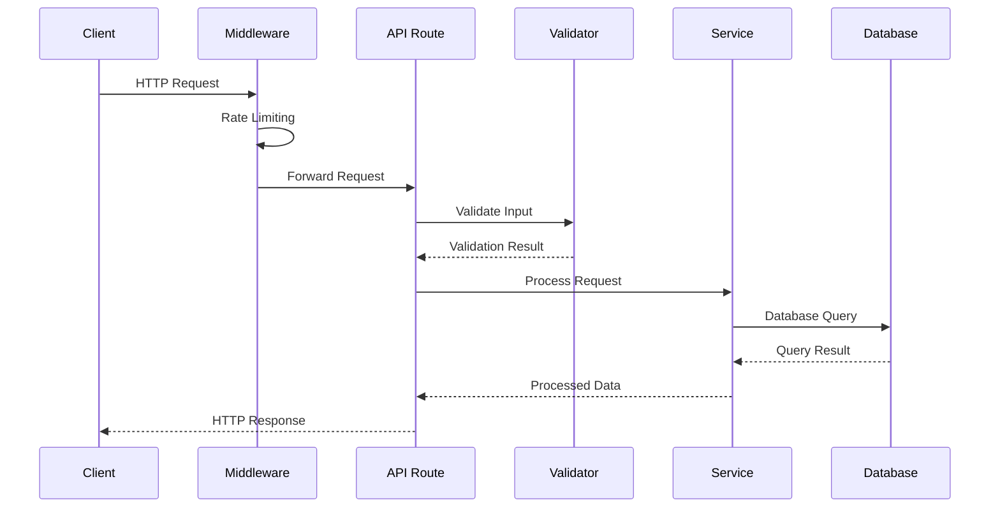
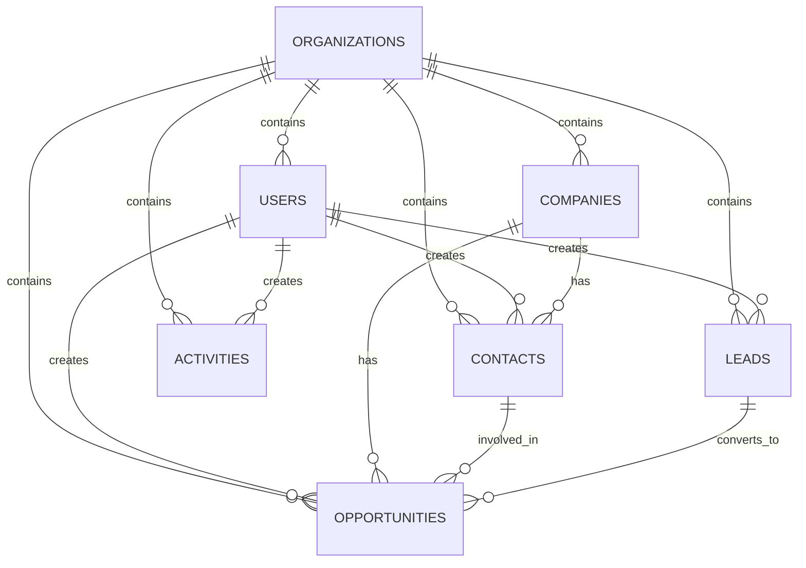
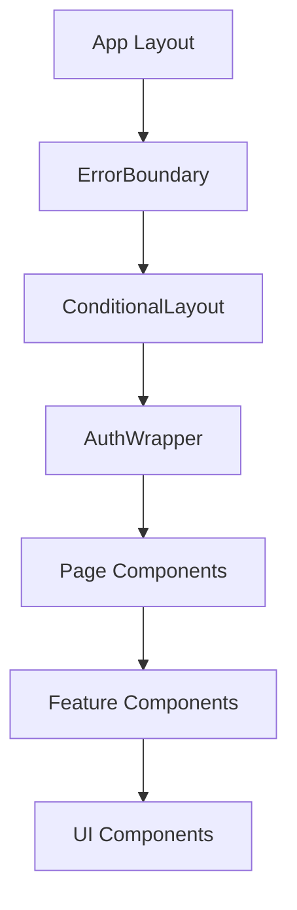
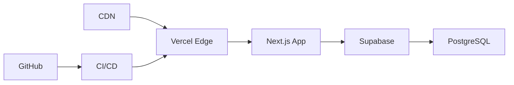

# Architecture Documentation

## Overview

FulQrun is a modern sales operations platform built with Next.js 14, TypeScript, and Supabase. The application follows a clean architecture pattern with clear separation of concerns and robust security measures.

## Technology Stack

### Frontend
- **Next.js 14**: React framework with App Router
- **TypeScript**: Type-safe JavaScript
- **Tailwind CSS**: Utility-first CSS framework
- **React Hook Form**: Form handling with validation
- **Zod**: Schema validation
- **DOMPurify**: HTML sanitization

### Backend
- **Supabase**: Backend-as-a-Service
  - PostgreSQL database
  - Authentication
  - Real-time subscriptions
  - Row Level Security (RLS)

### Development Tools
- **Jest**: Testing framework
- **ESLint**: Code linting
- **Prettier**: Code formatting
- **TypeScript**: Static type checking

## Architecture Patterns

### 1. Clean Architecture
The application follows clean architecture principles with clear layer separation:

```
┌─────────────────────────────────────┐
│           Presentation Layer        │
│         (React Components)          │
├─────────────────────────────────────┤
│           Application Layer         │
│         (API Routes, Hooks)         │
├─────────────────────────────────────┤
│            Domain Layer             │
│        (Business Logic, Types)      │
├─────────────────────────────────────┤
│          Infrastructure Layer       │
│      (Supabase, External APIs)      │
└─────────────────────────────────────┘
```

### 2. Service-Oriented Architecture
Key services are implemented as classes with clear interfaces:

- **AuthService**: Unified authentication management
- **ValidationService**: Input validation and sanitization
- **ErrorBoundaryService**: Error handling and recovery

### 3. Repository Pattern
Data access is abstracted through repository-like patterns:

- **Supabase Client**: Database operations
- **API Routes**: External service integration
- **Type Definitions**: Data contracts

## Directory Structure

```
src/
├── app/                    # Next.js App Router
│   ├── api/               # API routes
│   ├── auth/              # Authentication pages
│   ├── dashboard/         # Dashboard pages
│   └── ...                # Other pages
├── components/            # React components
│   ├── ui/               # Reusable UI components
│   ├── forms/            # Form components
│   └── ...               # Feature components
├── lib/                  # Core libraries
│   ├── auth-unified.ts   # Authentication service
│   ├── validation.ts     # Validation schemas
│   ├── supabase.ts       # Database client
│   └── ...               # Other utilities
├── hooks/                # Custom React hooks
├── types/                # TypeScript type definitions
└── __tests__/            # Test files
```

## Security Architecture

### 1. Authentication Flow


### 2. Authorization Model
- **Role-based Access Control (RBAC)**: Users have roles (rep, manager, admin)
- **Organization-based Isolation**: Data is isolated by organization
- **Row Level Security (RLS)**: Database-level access control
- **API Route Protection**: Server-side authentication checks

### 3. Data Protection
- **Input Validation**: All inputs validated using Zod schemas
- **HTML Sanitization**: User content sanitized with DOMPurify
- **SQL Injection Prevention**: Parameterized queries only
- **XSS Protection**: Content Security Policy and sanitization

## API Architecture

### 1. RESTful API Design
API routes follow RESTful conventions:

```
GET    /api/analytics/dashboard    # Get dashboard data
GET    /api/integrations           # List integrations
POST   /api/learning/progress      # Update learning progress
PUT    /api/opportunities/[id]     # Update opportunity
DELETE /api/leads/[id]             # Delete lead
```

### 2. Request/Response Flow


### 3. Error Handling
- **Validation Errors**: 400 Bad Request with detailed messages
- **Authentication Errors**: 401 Unauthorized
- **Authorization Errors**: 403 Forbidden
- **Rate Limiting**: 429 Too Many Requests
- **Server Errors**: 500 Internal Server Error

## Database Architecture

### 1. Schema Design
The database follows a normalized design with proper relationships:



### 2. Row Level Security (RLS)
All tables have RLS policies that ensure data isolation:

```sql
-- Example RLS Policy
CREATE POLICY "Users can view organization data" ON opportunities
    FOR ALL USING (organization_id = (
        SELECT organization_id FROM users WHERE id = auth.uid() LIMIT 1
    ));
```

### 3. Indexing Strategy
Strategic indexes for performance:

- **Primary Keys**: Clustered indexes on all tables
- **Foreign Keys**: Indexes on organization_id, user_id
- **Query Patterns**: Indexes on frequently queried columns
- **Composite Indexes**: Multi-column indexes for complex queries

## Component Architecture

### 1. Component Hierarchy


### 2. State Management
- **Local State**: React useState for component state
- **Server State**: Supabase queries with caching
- **Form State**: React Hook Form for form management
- **Global State**: Context API for shared state

### 3. Performance Optimizations
- **Code Splitting**: Dynamic imports for large components
- **Memoization**: React.memo for expensive components
- **Lazy Loading**: Components loaded on demand
- **Image Optimization**: Next.js Image component

## Deployment Architecture

### 1. Production Environment


### 2. Environment Configuration
- **Development**: Local development with hot reload
- **Staging**: Production-like environment for testing
- **Production**: Optimized build with monitoring

### 3. Monitoring & Observability
- **Error Tracking**: Error boundaries with logging
- **Performance Monitoring**: Core Web Vitals tracking
- **Security Monitoring**: Rate limiting and access logs
- **Database Monitoring**: Supabase dashboard

## Security Considerations

### 1. Threat Model
- **External Threats**: XSS, CSRF, injection attacks
- **Internal Threats**: Privilege escalation, data leakage
- **Infrastructure Threats**: DDoS, data breaches

### 2. Security Controls
- **Input Validation**: Comprehensive validation at all entry points
- **Output Encoding**: Proper encoding of all outputs
- **Authentication**: Multi-factor authentication support
- **Authorization**: Role-based access control
- **Audit Logging**: Comprehensive audit trail

### 3. Compliance
- **GDPR**: Data protection and privacy compliance
- **SOC 2**: Security and availability controls
- **OWASP**: Protection against top 10 vulnerabilities

## Scalability Considerations

### 1. Horizontal Scaling
- **Stateless Design**: No server-side state storage
- **Database Scaling**: Supabase handles database scaling
- **CDN**: Global content delivery
- **Caching**: Strategic caching at multiple levels

### 2. Performance Optimization
- **Bundle Optimization**: Code splitting and tree shaking
- **Image Optimization**: WebP/AVIF formats with lazy loading
- **Database Optimization**: Proper indexing and query optimization
- **Caching Strategy**: Multi-level caching implementation

### 3. Monitoring & Alerting
- **Performance Metrics**: Core Web Vitals monitoring
- **Error Rates**: Application error tracking
- **Resource Usage**: CPU, memory, and database monitoring
- **Security Events**: Authentication and authorization monitoring

## Development Guidelines

### 1. Code Standards
- **TypeScript**: Strict type checking enabled
- **ESLint**: Enforced code quality rules
- **Prettier**: Consistent code formatting
- **Testing**: Comprehensive test coverage

### 2. Git Workflow
- **Feature Branches**: Feature development in separate branches
- **Code Reviews**: Mandatory code reviews for all changes
- **Automated Testing**: CI/CD pipeline with automated tests
- **Security Scanning**: Automated security vulnerability scanning

### 3. Documentation
- **API Documentation**: Comprehensive API documentation
- **Component Documentation**: Storybook for UI components
- **Architecture Documentation**: This document and related docs
- **Deployment Documentation**: Deployment and operations guides

---

*This architecture documentation is maintained alongside the codebase and updated with each major release.*
